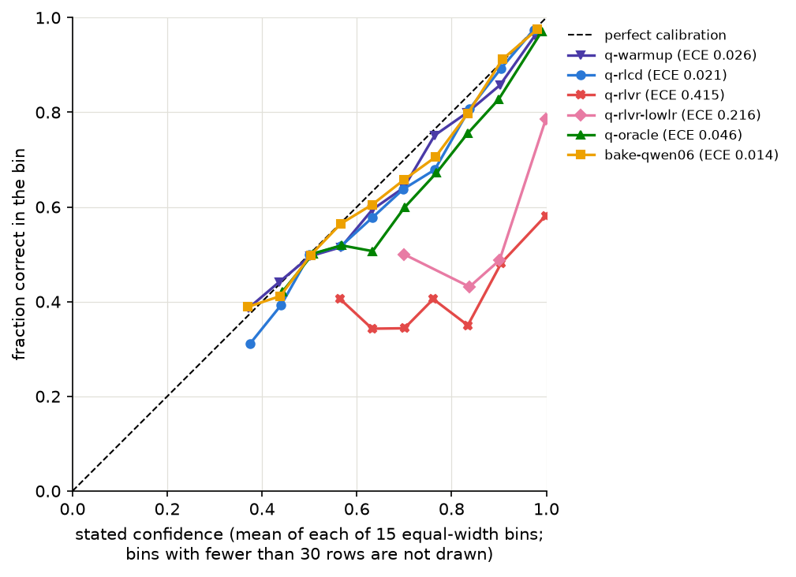

# eve-rlcd

A small decision model trained with reinforcement learning for calibrated decisions (RLCD): it answers typed questions over a shared state with a probability distribution over declared options, never with text, and the reward it was trained on pushes those probabilities toward how often the answer is right. The repository holds the training loop, the ablation against a plain outcome reward, the evaluation, and a decision-only export of the best run on Qwen3-0.6B-Base, published at [anthonym21/qwen3-0.6b-rlcd-decision](https://huggingface.co/anthonym21/qwen3-0.6b-rlcd-decision).

The name is left over from the first attempt on my own Eve-2 model; the base changed, the name did not (see History).

## What RLCD is here

A question is rendered as a prompt ending in `Assistant: The answer is`, the model runs one forward pass, and the logits at the last position are sliced to the 26 letter tokens ` A`..` Z` and softmaxed over the declared options. That K-way distribution is both the policy and the API output.

Training is a bandit. The policy samples one option `a` with probability `p_a`, the environment says whether it was correct (`c` is 1 or 0) and nothing else; the label stays hidden, so the other options are never graded. The reward is

```
r = c - p_a
```

Say 0.9 and be right: reward 0.1. Say 0.9 and be wrong: -0.9. Say 0.3 and be right: 0.7. REINFORCE with this reward is an unbiased estimator of half the gradient of the Brier score of the full distribution, using only the outcome of the taken action (the identity is checked numerically in `tests/test_rewards.py`). The comparison arm, RLVR, uses `r = c` with the same loop; the two differ by one subtraction. Both use a leave-one-out group baseline over 4 sampled actions per prompt, no KL term, no entropy bonus. The reason it is RL rather than supervised learning is the feedback: with the label in hand the Brier score is a differentiable loss and you would just minimize it; with only the outcome of the taken action you cannot, and a support system that routes a ticket to Billing learns whether Billing was right, never what the other departments would have been.

## Results

Qwen3-0.6B-Base, a 100-step supervised warmup on 6,400 labeled rows, then 500 RL steps over 32,000 disjoint rows under bandit feedback. Every number is on the held-out 8,000-row test split at temperature 1. Cells with three values are mean [min, max] across the runs of that arm (one local RTX 4080 run at seed 0 and two Colab A100 runs at seeds 1 and 2). Lower is better for ECE, Brier loss and NOTA false alarm.

| arm | n runs (hardware) | accuracy | ECE (15 bins) | Brier loss | mean confidence | confidence minus accuracy | NOTA recall | NOTA false alarm |
|---|---|---|---|---|---|---|---|---|
| warmup (100-step SFT on 6,400 rows) | 2 (local, colab) | 0.748 [0.746, 0.750] | 0.022 [0.019, 0.026] | 0.339 [0.339, 0.340] | 0.763 [0.755, 0.770] | 0.015 [0.006, 0.025] | 0.531 [0.501, 0.561] | 0.072 [0.061, 0.083] |
| supervised continuation (500 more SFT steps, same 6,400 rows) | 1 (colab) | 0.778 | 0.192 | 0.407 | 0.969 | 0.192 | 0.739 | 0.099 |
| RLCD | 3 (local, colab, colab) | 0.808 [0.806, 0.811] | 0.023 [0.020, 0.029] | 0.267 [0.264, 0.269] | 0.830 [0.824, 0.839] | 0.022 [0.018, 0.028] | 0.793 [0.779, 0.806] | 0.075 [0.067, 0.091] |
| RLVR, shared settings (lr 2e-5, stopped) | 1 (local) | 0.576 | 0.415 | 0.835 | 0.991 | 0.415 | 0.599 | 0.406 |
| RLVR, low lr (4e-6) | 3 (local, colab, colab) | 0.778 [0.775, 0.780] | 0.213 [0.209, 0.216] | 0.432 [0.424, 0.439] | 0.991 [0.989, 0.993] | 0.213 [0.209, 0.216] | 0.715 [0.709, 0.721] | 0.090 [0.085, 0.098] |
| oracle (labels revealed, same RL rows) | 3 (local, colab, colab) | 0.819 [0.817, 0.822] | 0.059 [0.046, 0.072] | 0.256 [0.253, 0.258] | 0.878 [0.868, 0.890] | 0.059 [0.046, 0.072] | 0.830 [0.807, 0.849] | 0.076 [0.067, 0.088] |
| 32k-label SFT reference (500 steps on rows 0..31999) | 1 (local) | 0.817 | 0.014 | 0.251 | 0.829 | 0.013 | 0.843 | 0.089 |



What the numbers show. RLCD learns from bandit feedback and keeps the warmup's calibration: accuracy goes from 0.748 to 0.808 while ECE stays at 0.023 (warmups 0.022), and the paired accuracy and Brier gains against each run's own warmup exclude zero on all three seeds. The same loop with the outcome-only reward does not keep it. At the shared learning rate RLVR collapses inside 50 steps and the stop rule ends it at step 150 with mean confidence 0.991 and ECE 0.415; at a fifth of the rate it keeps its accuracy (0.778) but says 0.991 on average and its Brier loss (0.432) is worse than the warmup it started from (0.339). The oracle, which sees the label on the same rows, is about one accuracy point ahead of RLCD and worse calibrated (ECE 0.059, mean confidence 0.878 against accuracy 0.819). Five more supervised passes over the warmup's own 6,400 labels reach 0.778 with ECE 0.192, so the gain is not just more steps. On the known-posterior probe (fresh synthetic tickets whose true posterior the generator fixes) RLCD's max probability on tickets with two equally cued departments is 0.593 against 0.798 for the warmup and 0.990 for RLVR low lr, with 0.5 the ideal.

What they leave open. RLCD did not improve calibration over the warmup; it held it, within about 0.01 ECE, and its validation ECE wandered up to 0.06 to 0.12 mid-training before ending low. RLCD ran at lr 2e-5 and the three-seed RLVR arm at 4e-6, because RLVR at 2e-5 collapses; RLCD at 4e-6 was not run, and no KL term, entropy bonus or temperature was tried to rescue RLVR, so the finding is about this REINFORCE recipe at these settings. RLCD with 6,400 labels plus 32,000 bandit rows lands just behind one supervised pass over 32,000 labels (accuracy -0.009, Brier +0.017), which is the cheaper thing to do if you have the labels. Everything is in-distribution on the datasets the model trained on. The paired bootstrap intervals, per-source tables, the probe, the training curves and the caveats are all in [docs/results.md](docs/results.md), which `scripts/consolidate_results.py` generates from the run files.

## The decision API

`Decider.ask(state, questions)` takes one state string and a list of typed questions (`ChoiceQ` over unordered options, `ScoreQ` over ordered levels, `NoulQ` for a yes/no question) and returns one typed answer per question without generating text. The state is prefilled once and every question suffix runs in one batched forward against the shared key/value cache, so each question sees the state and nothing else, and the answers equal what the single full-prompt pass gives (to about 1e-6 in fp32).

```python
from rlcd.decide import ChoiceQ, Decider, NoulQ, ScoreQ

d = Decider.load("runs/q-rlcd/decision")
answers = d.ask("Ticket #4242 from an enterprise, tier 1 customer. Report: API latency spiked to 4 seconds; load balancer returning 502s. Note: all customers affected.",
                [ChoiceQ("Which department should handle this ticket?", ["BILLING", "INFRASTRUCTURE", "SECURITY", "PRODUCT_SUPPORT"]),
                 ScoreQ("What is the priority of this ticket?", ["P3_LOW", "P2_NORMAL", "P1_HIGH", "P0_CRITICAL"]),
                 NoulQ("Should an on-call engineer be paged immediately?")])
```

The answers `scripts/demo_decide.py` prints for exactly this call on the export of `runs/q-rlcd` (66.1 ms for the three questions on an RTX 4080):

```json
[
  {
    "kind": "choice",
    "value": "INFRASTRUCTURE",
    "probs": {
      "BILLING": 0.059814393569016855,
      "INFRASTRUCTURE": 0.869700795598093,
      "SECURITY": 0.044770215680045786,
      "PRODUCT_SUPPORT": 0.025714595152844414
    },
    "confidence": 0.869700795598093,
    "entropy_confidence": 0.6226758237190544
  },
  {
    "kind": "score",
    "value": "P0_CRITICAL",
    "probs": {
      "P3_LOW": 0.002271013985650127,
      "P2_NORMAL": 0.002937758814346358,
      "P1_HIGH": 0.002244528100786117,
      "P0_CRITICAL": 0.9925466990992174
    },
    "confidence": 0.9925466990992174,
    "entropy_confidence": 0.9624410710472786,
    "score": 0.9950223041045235
  },
  {
    "kind": "noul",
    "p_true": 0.8894891738891602,
    "confidence": 0.8894891738891602
  }
]
```

Latency on an RTX 4080 with the body in fp32 (the default), medians of 7: 8 questions on an 800-token state take 105.3 ms through `ask` against 440.9 ms for the same prompts run one by one (4.19x); 64 questions take 472.2 ms against 3679.1 ms (7.79x). Below about 2 questions the sequential path is faster, because a forward of this 28-layer model costs about 45 ms of launch overhead regardless of length and `ask` is two forwards. The equivalence proof, the bf16 `fast=True` mode and its rounding floor, the full latency tables and the export format are in [docs/inference.md](docs/inference.md).

## Reproduce

Environment: Python 3.12 managed by uv; `pyproject.toml` pins the PyTorch cu128 index, so `uv sync` installs a CUDA build of torch. `uv run pytest` runs the CPU tests (the `network` and `gpu` markers are excluded by default). The current environment resolves to torch 2.11.0+cu128 and transformers 5.17.0; the published runs were produced under transformers 4.57.6 on one RTX 4080 (16 GB) under Windows 11. Re-evaluating the released checkpoint under 5.17.0 reproduces its test accuracy, ECE and Brier loss within the 0.002 bf16 rounding floor stated in `docs/inference.md`, and the decision API's fp32 equivalence proof still passes.

Data. `data/` is gitignored and built from the seven public datasets plus the synthetic triage generator:

```
uv run python -m rlcd.data build --out data --per-source 8000 --seed 0
```

The exact bytes the runs used are attached to the GitHub release `data-v1` (`train.jsonl` md5 `cdfee4c9792751cf5b22668eb3f9dc33`, `val.jsonl` `4b95911ffc76ed1789f7989f623d0a5a`, `test.jsonl` `15c33b165d70639d8bd7d23d624908f4`), because a later rebuild on Colab produced different bytes: the Hub dataset revisions are not pinned. The Colab notebook downloads the release files and checks the hashes instead of rebuilding.

Warmup (100 steps, rows 0..6399, about 8 minutes locally):

```
uv run python -m rlcd.train_sft --init Qwen/Qwen3-0.6B-Base --data data/train.jsonl --start 0 --n 6400 --epochs 1 --accum 16 --lr 2e-5 --eval-data data/val.jsonl --eval-every 25 --eval-n 2000 --out runs/q-warmup --backend hf-decoder --grad-checkpointing --micro 4
```

The four RL arms, all from the warmup, rows 32000..63999, 2 epochs, 128 prompts per step, 4 samples per prompt (RLCD took 4234 s locally, peak VRAM 11.4 GB):

```
uv run python -m rlcd.train_rl --init runs/q-warmup --start 32000 --epochs 2 --accum 32 --group 4 --kl 0 --eval-data data/val.jsonl --eval-every 50 --eval-n 2000 --save-every 100 --arm rlcd --lr 2e-5 --out runs/q-rlcd --backend hf-decoder --grad-checkpointing --micro 4
uv run python -m rlcd.train_rl --init runs/q-warmup --start 32000 --epochs 2 --accum 32 --group 4 --kl 0 --eval-data data/val.jsonl --eval-every 50 --eval-n 2000 --save-every 100 --arm rlvr --lr 2e-5 --out runs/q-rlvr-b --backend hf-decoder --grad-checkpointing --micro 4
uv run python -m rlcd.train_rl --init runs/q-warmup --start 32000 --epochs 2 --accum 32 --group 4 --kl 0 --eval-data data/val.jsonl --eval-every 50 --eval-n 2000 --save-every 100 --arm rlvr --lr 4e-6 --out runs/q-rlvr-lowlr --backend hf-decoder --grad-checkpointing --micro 4
uv run python -m rlcd.train_rl --init runs/q-warmup --start 32000 --epochs 2 --accum 32 --group 4 --kl 0 --eval-data data/val.jsonl --eval-every 50 --eval-n 2000 --save-every 100 --arm oracle --lr 2e-5 --out runs/q-oracle --backend hf-decoder --grad-checkpointing --micro 4
```

The 32k-label SFT reference is the bake-off warmup: `rlcd.train_sft --init Qwen/Qwen3-0.6B-Base --start 0 --n 32000 --epochs 1 --accum 16 --lr 2e-5 --out runs/bake-qwen06`, otherwise as the warmup above.

Evaluate a checkpoint on the test split and on the known-posterior probe, then compare runs with paired bootstraps and draw the curves:

```
uv run python -m rlcd.eval run --model runs/q-rlcd --name q-rlcd --out runs/q-rlcd/eval --split data/test.jsonl
uv run python -m rlcd.eval probe --model runs/q-rlcd --name q-rlcd --out runs/q-rlcd/eval
uv run python -m rlcd.eval compare --runs q-warmup=runs/q-warmup/eval q-rlcd=runs/q-rlcd/eval q-rlvr=runs/q-rlvr-b/eval q-rlvr-lowlr=runs/q-rlvr-lowlr/eval q-oracle=runs/q-oracle/eval bake-qwen06=runs/bake-qwen06/eval --pairs q-rlcd:q-warmup q-rlcd:q-rlvr-lowlr q-rlcd:q-oracle q-rlcd:bake-qwen06 q-rlcd:q-rlvr q-oracle:bake-qwen06 --out runs/q-compare
uv run python -m rlcd.eval curves --runs q-rlcd=runs/q-rlcd q-rlvr=runs/q-rlvr-b q-oracle=runs/q-oracle q-rlvr-lowlr=runs/q-rlvr-lowlr --offset q-rlcd=100 q-rlvr=100 q-oracle=100 q-rlvr-lowlr=100 --out runs/q-compare
```

Seeds 1 and 2 and the supervised continuation ran on a Colab A100 from `colab/eve_rlcd_colab.ipynb`, which clones the repo, fetches the release data, and runs the job list `colab/jobs-a100-seeds.json` through `colab/runner.py`, uploading each finished run to a private Hub dataset repo so a runtime reset loses nothing. The Colab commands are the same as above with `--micro 8 --accum 8` (SFT) or `--micro 8 --accum 16` (RL), no gradient checkpointing, and `--seed 1` or `--seed 2`; the effective batch is unchanged. With the Colab runs under `runs/colab/runs/`, `uv run --no-sync python scripts/consolidate_results.py` regenerates `docs/results.md` and `docs/img/` byte for byte.

Export, check and demo the decision model:

```
uv run python -m rlcd.export --src runs/q-rlcd --out runs/q-rlcd/decision
uv run python scripts/check_decide.py --model runs/q-rlcd
uv run python scripts/demo_decide.py --model runs/q-rlcd/decision
```

## Repository layout

```
rlcd/
  schema.py       question types, validation, prompt rendering, letter token ids
  data.py         dataset converters, NOTA injection, synthetic triage, the build CLI
  env.py          bandit environment: reveals only whether the sampled action was correct
  rewards.py      rlvr, rlcd, the leave-one-out policy-gradient loss, the supervised loss
  policies.py     backend-agnostic policies (hf-decoder, hf-mlm, eve): one forward, 26 letter logits
  policy.py       the original sliced-softmax policy over Eve-2
  loop.py         shared pieces of the training scripts: schedules, logging, checkpointing, the stop rule
  train_sft.py    warmup SFT on a labeled slice
  train_rl.py     the RL loop: rlvr, rlcd and oracle arms from one warmup
  quick_eval.py   fast held-out evaluation used during training
  metrics.py      ECE, Brier, coverage-error, bootstrap and paired-bootstrap intervals
  eval.py         test-split predictions, the known-posterior probe, compare tables, curves
  calibrate.py    post-hoc temperature scaling, reference only
  decide.py       the decision API: shared-prefix parallel questions, typed answers
  export.py       the decision-only export and its strict loader
  compat.py       workarounds for the vendored Eve code under current transformers
  eve/            vendored Eve-2 modeling code (the first base; unused by the Qwen runs)
scripts/
  demo_decide.py  one ticket, three questions, JSON answers
  check_decide.py equivalence and independence proofs for ask() on a real checkpoint
  bench_decide.py latency of ask() against the sequential path
  consolidate_results.py  docs/results.md and docs/img from the run files
  smoke_policy.py readout checks on a base before spending GPU hours on it
colab/            notebook, job list and runner for the A100 seed runs
tests/            CPU tests; gpu and network tests behind markers
docs/             results.md, inference.md, the figures, the original design plan
```

## History

The project started on my own 272M mixture-of-experts model, Eve-2-MoE-IT-272M, as a toy recreation of the RLCD training objective described in a product announcement (see Credits). The calibration contrast already showed on that base (test set: RLCD 0.654 accuracy at ECE 0.036; the fair RLVR configurations 0.545 to 0.573 at ECE 0.297 to 0.384; the oracle 0.709 at 0.068), but Eve never learned BoolQ or MNLI and needed about 20,000 labeled examples before it read the options at all, which made the bandit phase a test of a model that could barely do the task. A bake-off after an identical 32,000-row warmup gave LFM2.5-350M 0.733, Qwen3-0.6B-Base 0.817 at ECE 0.014, LFM2.5-1.2B with LoRA 0.817, and LFM2.5-Encoder-350M 0.747 (MNLI 0.49). Qwen was chosen for the accuracy, the Apache-2.0 license, and a plain key/value cache that the decision API could share across questions; the warmup then shrank from 32,000 rows to 6,400, because after a 32,000-row warmup Qwen was already at 0.817 and the RL stage would have had almost nothing left to learn.

## Limitations

- One warmup per hardware. The local RL arms started from the local warmup and both Colab seeds from the one Colab warmup, so "seed" varies the sampling, the warmup checkpoint, the GPU, the micro-batch shape and gradient checkpointing together. The seed spread includes hardware variation.
- bf16 is not deterministic. Two shared-settings RLVR attempts with the same seed and command took different trajectories, and scoring the same checkpoint with a different batch shape moves the third decimal. Numbers are printed to three decimals so the tables agree with the files, not because the third decimal is stable.
- The shared-settings RLVR arm is one local run stopped at step 150 by the rule "eval_acc more than 0.10 below step 0 for three consecutive evals"; it was not rerun on Colab. The three-seed RLVR comparison is the low-lr arm.
- RLCD at lr 2e-5 is compared with RLVR at 4e-6, five times lower, because RLVR at 2e-5 collapses. RLCD at 4e-6 was not run, and no KL term, entropy bonus or temperature was tried to keep RLVR calibrated.
- Plug-in ECE is biased upward and its bootstrap interval inherits the bias, so overlapping per-run intervals say little; read the paired differences. The evaluator resamples whole contexts and applies the same sampled contexts to both runs. These intervals cover test-context sampling only, not training noise; the three runs are the only estimate of that.
- Everything is in-distribution: the test split is a held-out slice of the same public classification datasets and the same synthetic triage generator, prompts of at most 512 tokens. The probe is fresh synthetic triage with a known posterior. No out-of-distribution evaluation was run, and calibration on real tickets or longer prompts is unmeasured.
- The export removes the language-model head from the API, but Qwen3-0.6B ties its output head to the input embedding, so the vocabulary projection is recoverable from the embedding that the body still needs. It is a decision model as far as this code is concerned, not a model that cannot generate.
- A `NoulQ` must be phrased as a yes/no question, as the training rows were; a bare proposition is a prompt the model was not trained on. Cardinality is capped at 26 options, one letter each.

## Credits and license

The idea came from TypeSafe's Jev announcement, which I wrote about in [Jev: The Language Model That Won't Talk](https://anthonymaio.substack.com/p/jev-the-language-model-that-wont) (2026-09-16); TypeSafe has published no method, and nothing here claims to reproduce theirs. The reward follows the same line as "Rewarding Doubt" (Stangel et al., 2025), which trains verbalized confidence with a proper-scoring-rule reward under RL. Temperature scaling, reported for reference only, is Guo et al., "On Calibration of Modern Neural Networks" (2017). The inference pattern of prefilling a shared state once and scoring declared options at one position comes from [harshatheg/Qwen-2.5-1B-RLCD](https://huggingface.co/harshatheg/Qwen-2.5-1B-RLCD), a constrained-decoding engine over a stock model; this project supplies the training. The base model is [Qwen/Qwen3-0.6B-Base](https://huggingface.co/Qwen/Qwen3-0.6B-Base). Training data: Bitext customer support, Banking77, AG News, MultiNLI, SST-5, Yelp reviews, BoolQ, and a synthetic triage generator in `rlcd/data.py`.

The code is MIT licensed. The trained weights inherit Qwen3's Apache-2.0 license.
