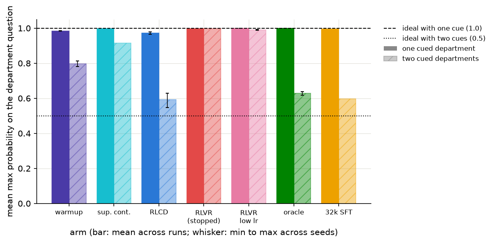

# Training a 0.6B model to be honest about uncertainty

The reward worked.

A 0.6B model learned from right-or-wrong outcomes and gained six accuracy points without losing the calibration it started with. On fresh synthetic tickets where the correct answer was a literal coin flip, its mean maximum probability was 0.593. The same training loop with an outcome-only reward said 0.990.

That 0.593 needs context. About 8.5 percent of the probability leaked to options the ticket did not support, so the model became less certain and a little less sharp. The contrast repeated across three RLCD runs and three low-rate RLVR runs. That comparison also crosses learning rates, a limitation I return to below.

[TypeSafe introduced Jev](https://typesafe.ai/blog/introducing-system-one-models-and-jev) as a model that reads state and returns typed decisions with calibrated probabilities instead of generating strings. The company named its training method Reinforcement Learning for Calibrated Decisions, or RLCD, without publishing the reward or training recipe.

I wanted to test the smallest version of that idea that could fail. This independent experiment tests my own interpretation. Jev's architecture and objective remain unknown.

## The reward

Start with a support system that routes a ticket to Billing. Later, the system learns whether Billing was the right call. It does not receive a label for every department it could have chosen.

That is bandit feedback. The model sees the outcome of the action it took.

The obvious reinforcement-learning reward is correctness:

```text
r = c
```

`c` is 1 when the sampled action is correct and 0 when it is wrong. I used this instead:

```text
r = c - p(a)
```

`p(a)` is the probability the model assigned to the action before sampling it. A 90 percent prediction that turns out to be right earns 0.1. The same prediction when wrong earns -0.9. A 30 percent prediction that is right earns 0.7.

The subtraction changes the target. Correctness alone keeps paying a calibrated policy to become sharper. Subtracting `p(a)` removes that pressure at calibration.

The math is clean. With `p(a)` detached from the reward, the gradient of the REINFORCE loss is an unbiased estimate of half the gradient of multiclass Brier loss. The [gradient test in the repository](../../tests/test_rewards.py) enumerates every action and checks the identity against autograd to floating-point roundoff.

This sits near prior work on proper-scoring-rule rewards, especially [Rewarding Doubt](https://arxiv.org/abs/2503.02623) by Bani-Harouni et al. That paper trains verbalized confidence with a logarithmic scoring rule. Here, the probability distribution is the policy itself and the reward uses Brier geometry.

## The experiment

I used Qwen3-0.6B-Base. Each prompt contains a state and one question with up to 26 lettered options. The policy reads the final hidden state, slices out the 26 letter logits, masks unused letters, and applies a softmax. One decision takes one forward pass. There is no generation loop.

The training set contains 64,000 rows drawn from seven public classification datasets plus a synthetic IT-triage generator. Every RL arm begins from a 100-step supervised warmup on 6,400 labeled rows. That checkpoint scored 0.748 accuracy with 0.022 expected calibration error, or ECE.

The RL stage uses 32,000 different rows for two epochs and 500 optimizer steps. The bandit arms only receive the outcome of each sampled action.

- RLCD uses `c - p(a)` at a learning rate of 2e-5.
- RLVR uses `c`. I ran it at 2e-5 and again at 4e-6 after the shared rate collapsed.
- The oracle sees the full label on the same 32,000 rows.
- The control keeps training on the warmup's 6,400 labels for 500 more steps.

The runs share their data order and initial checkpoint. They do not share sampled actions throughout training. This is on-policy RL, so their trajectories split as soon as the weights move.

RLCD, low-rate RLVR, and the oracle each have three runs: one on my RTX 4080 and two on a Colab A100. The two Colab runs share one Colab warmup. Every number below comes from the same 8,000-row held-out test split at temperature 1.

## Results

| arm | accuracy | ECE | Brier loss | mean confidence |
|---|---:|---:|---:|---:|
| warmup | 0.748 | 0.022 | 0.339 | 0.763 |
| RLCD, outcomes only | 0.808 [0.806, 0.811] | 0.023 [0.020, 0.029] | 0.267 [0.264, 0.269] | 0.830 |
| RLVR, low learning rate | 0.778 [0.775, 0.780] | 0.213 [0.209, 0.216] | 0.432 [0.424, 0.439] | 0.991 |
| RLVR, shared rate, stopped at step 150 | 0.576 | 0.415 | 0.835 | 0.991 |
| supervised continuation on warmup labels | 0.778 | 0.192 | 0.407 | 0.969 |
| oracle, full labels | 0.819 [0.817, 0.822] | 0.059 [0.046, 0.072] | 0.256 [0.253, 0.258] | 0.878 |
| supervised, 32,000 labels | 0.817 | 0.014 | 0.251 | 0.829 |

Bracketed cells are mean [minimum, maximum] across three runs. The warmup averages two checkpoints. Single-value controls ran once.

RLCD held calibration while it learned. It did not improve ECE, and I do not want to blur that distinction. Accuracy moved from 0.748 to 0.808. Brier loss dropped from 0.339 to 0.267.

The stable RLVR comparison needed one-fifth of RLCD's learning rate. It gained three accuracy points, then drove mean confidence to 0.991 and ECE to 0.213 on all three runs. At the shared 2e-5 rate, the one RLVR run collapsed inside 50 steps and hit the stop rule at step 150.


The supervised controls set the scope. Five more passes over the same 6,400 labels produced an overconfident model. One pass over 32,000 labels reached 0.817 accuracy and 0.014 ECE, the best calibration in the study. If you have those labels, use them. RLCD is for the case where deployment gives you outcomes.

## A probe with a known answer

ECE can average away structure, so I built a test where the posterior is fixed by the data generator.

Some synthetic tickets contain one department cue, where the correct probability is 1.0. Thirty percent contain cues for two departments, and the generator chooses between them with equal probability. No text feature breaks the tie. A separate escalation label is flipped at random 10 percent of the time, setting its correct confidence to 0.90.

| arm | one cue, ideal 1.0 | two cues, ideal 0.5 | escalation, ideal 0.90 |
|---|---:|---:|---:|
| warmup | 0.984 | 0.798 | 0.821 |
| RLCD | 0.973 | 0.593 | 0.932 |
| RLVR, low rate | 0.999 | 0.990 | 1.000 |
| oracle | 1.000 | 0.630 | 0.880 |



RLCD moved the ambiguous case from 0.798 toward 0.5. RLVR moved it to 0.990. The oracle reached 0.630 with labels.

The leakage caveat is real. RLCD placed 0.915 total probability on the two cued departments, compared with 0.998 for the oracle. Its 0.593 maximum came from a fairer split and from probability assigned to unsupported departments. The probe supports the calibration claim, with a visible precision cost.

## The decision interface

The checkpoint exposes unordered choices, ordered scores, and yes/no questions. Give it one state and a question list. The runtime prefills the state once, keeps its key-value cache, then evaluates the suffixes as one batch.

In fp32, the cached path matches the training-time full-prompt path at its own rounding floor. Reordering questions is bit-identical. Adding unrelated questions changed probabilities by at most 1.08e-5 in the 300-row equivalence check.

On my 4080, eight questions against an 800-token state took 105.3 ms, compared with 440.9 ms one prompt at a time. Sixty-four took 472.2 ms instead of 3,679.1 ms. A single question is faster through the sequential path; by four questions the shared prefix wins in both measured precision modes.

The export removes the full vocabulary projection and keeps a 26-row decision head. Qwen ties its output projection to the input embedding, so the vocabulary head can be reconstructed by someone determined to do it. The artifact removes generation from the supported API. It does not make generation physically impossible.

## Limits

This study is small. The runs mix seed and hardware differences. Their micro-batch shapes also differ, and two runs share a warmup. They provide mixed-condition repeatability evidence rather than three clean seed replicates.

The low-rate RLVR comparison also changes two variables: reward and learning rate. RLCD at 4e-6 was never run. I did not test KL or entropy regularization for RLVR, and I did not fit post-hoc temperature. The result supports a narrow claim: this outcome-only REINFORCE recipe became overconfident at both tested rates.

Everything is in-distribution. The test split comes from the same source datasets and synthetic generator as training. Prompts stop at 512 tokens. Calibration on real support tickets or new domains remains unmeasured. So do longer contexts.

The detailed results were generated with an earlier row-bootstrap implementation. Those historical intervals treat correlated questions as independent and can be too narrow. The 8,000 rows contain 6,936 unique contexts. Triage contributes 1,000 questions from 334 tickets, and some BoolQ passages repeat. The evaluator now records a stable context ID and resamples whole contexts for single-run and paired intervals. The table above uses seed ranges rather than the old intervals.

RLCD's validation ECE also rose mid-training before falling at the final checkpoint. The reported checkpoint was the last step. Final ECE does not describe the whole trajectory.

The first version used my 272M Eve-2 mixture-of-experts model. The reward contrast appeared there, but Eve never learned MNLI or BoolQ well enough. An identical 32,000-row supervised bake-off put Eve at 0.526 accuracy and Qwen3-0.6B at 0.817. I kept the repository name and replaced the base.

## What I learned

One subtraction changed what the optimizer paid for. The outcome-only model drove confidence to 0.99. With `c - p(a)`, accuracy climbed while calibration held.

TypeSafe's method and Jev's production claims remain outside this evidence. The experiment shows that a proper-scoring reward can learn from sparse outcomes without turning every decision into false certainty.

The [code and full results](https://github.com/anthony-maio/eve-rlcd) are public. The [decision-only checkpoint and model card](https://huggingface.co/anthonym21/qwen3-0.6b-rlcd-decision) are on Hugging Face.
